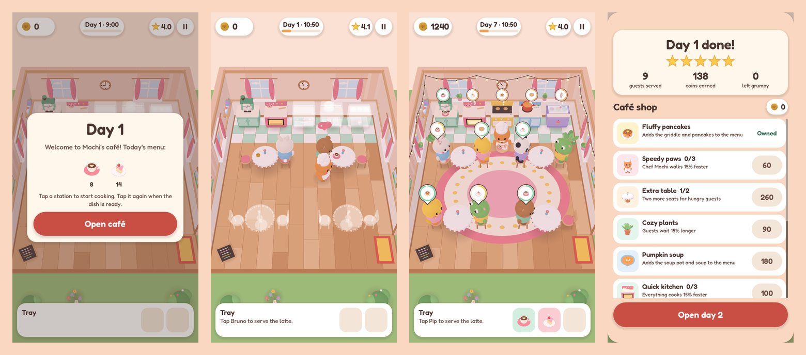
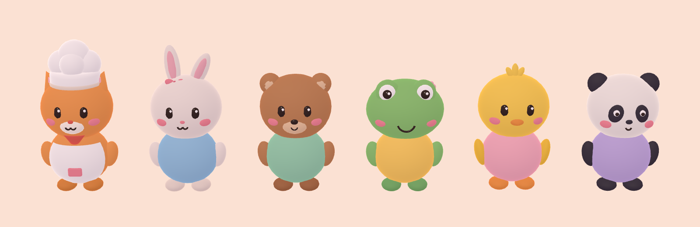
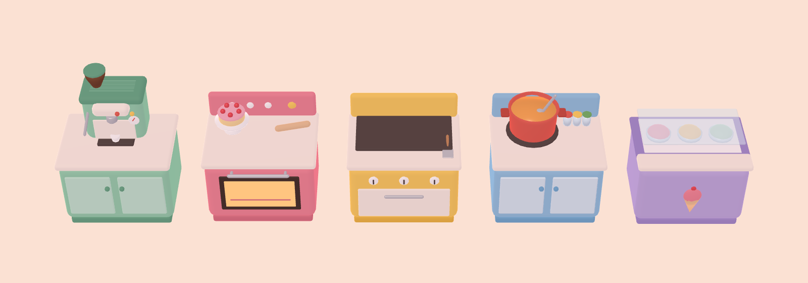
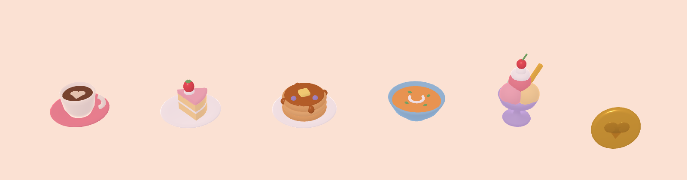

# Cozy Mini Restaurant

A cozy, cute 3D restaurant game for phones, made with **Godot 4**. You play Chef Mochi, a ginger cat who runs a tiny pastel café. Cook for animal regulars, serve them before they get grumpy, tidy their tables and spend your tips on new recipes, furniture and décor.



## How to play

Everything is one-finger taps, in portrait.

| Tap | What Chef Mochi does |
| --- | --- |
| A **station** (coffee machine, oven, …) | Walks over and starts cooking. With nothing else queued, the chef waits and picks up the dish when it's ready. Tap a finished station to grab the dish. |
| A **guest** with an order bubble | Serves them if that dish is on the tray. |
| **Coins** on a table | Collects the tip and frees the seat for the next guest. |
| The **floor** | Walks there. |

- Taps queue up, up to five, and a ring on the floor marks each stop.
- Each guest's bubble shows the dish they want. The ring around it is their patience: green, then yellow, then red. When it runs out they leave grumpy and pay nothing.
- Faster service means bigger tips and a better star rating.
- The tray holds two dishes (three with the Big Tray upgrade).
- Each day runs from 9:00 to 17:00. At closing, the café shop opens.

### The regulars

Every guest species has a personality. Its name pops up when the guest sits down, and the day card introduces one regular each day.

| Guest | Trait | Effect |
| --- | --- | --- |
| Pip (bunny) | Sweet tooth | Only orders desserts, tips a little more |
| Bruno (bear) | Big appetite | Always orders two dishes, waits longer |
| Lily (frog) | Easygoing | Very patient, tips a little less |
| Sunny (chick) | In a hurry | Short patience, big tips |
| Bao (panda) | Food critic | Orders the fanciest dish; his stars and XP count double |

### Friendship hearts

Every regular has a hidden favourite dish and a five-heart friendship meter.

- A happy visit earns friendship points: 1 point, or 2 for a 4.5+ star visit, plus 1 if you served their favourite ("Favourite!" pops up).
- Each new heart comes with a coin gift from that guest (10 × the heart number).
- At 3 hearts a regular tips 10% more, and at 5 hearts they wait 20% longer.
- A regular's favourite is revealed in the book once you reach their first heart.

### Collection book

Tap the book button in the top bar (or **Book** on the end-of-day screen). The game pauses while it's open. It has three tabs:

- **Regulars:** portraits, traits, hearts, visits, favourite dish, next gift and friend perks.
- **Menu:** every dish with how often you've served it and who loves it. Dishes you haven't unlocked show as silhouettes.
- **Stickers:** 12 achievements with progress bars and coin rewards, such as *Perfect day* (5+ guests, nobody grumpy), *Combo king* (10 combos), *Critic's choice* (5 stars from Bao), *Best friends* (5 hearts) and *Piggy bank* (1000 coins earned).

New hearts and stickers show up as toasts while you play and are listed on the results screen.

### Helpers

Two helpers can be hired in the Upgrades shop. Each walks around the café on its own and never takes a job the chef has already queued.

- **Nibbles the hamster** (café level 2, 240 coins) is a busser. Nibbles collects tips from tables so seats free up for new guests.
- **Pepper the penguin** (café level 3, 380 coins) is a waiter. When a dish is ready and a waiting guest wants it, Pepper picks it up and serves it. You still do the cooking.

### Day events and seasons

From day 3, most days have an event, shown on the day card:

| Event | Effect |
| --- | --- |
| Rush hour | Around lunchtime, guests arrive twice as fast and tip 50% more |
| Rainy day | Soup and lattes are ordered more, guests are more patient, and it rains outside |
| Sunny day | Sundaes and cakes are ordered more, and tips are 10% bigger |
| Critic day | Bao and his critic friends visit much more often |
| Combo festival | Most orders are combos, and combos pay 50% extra |

The **season** follows the phone's calendar. It recolours the trees and grass, sets the outside weather (spring petals, autumn leaves, winter snow), and makes one dish 20% pricier: cake in spring, sundae in summer, pumpkin soup in autumn, lattes in winter.

### Style and decorating

The end-of-day shop has two tabs: **Upgrades** and **Style & décor**.

- **Wallpaper** (6 themes) and **floor** (4 themes) recolour the café walls, curtains, planks and kitchen tiles.
- **Chef outfits** (6) recolour Chef Mochi's hat, apron and scarf. Three are gifts from regulars at 3 hearts (Lily, Sunny and Bao), and one needs café level 5.
- **Décor** (potted fern, round bush, flower tub, floor lamp, bookcase) goes into storage when you buy it. Each placed piece adds *charm*: +2% tips per point, up to +30%.

Tap **Decorate** on the day card to rearrange the café:

- Tap a table, the menu board or a décor piece to pick it up, then tap the floor to move it (it snaps to a grid).
- Tap a décor icon in the storage strip, then tap the floor to place it.
- **Rotate** turns décor 45°, and **Store** puts it back in storage.
- Every move is checked. You can't block the door or the kitchen walkway, pieces can't overlap, and guests and the chef must still be able to reach every seat and station.

Your layout, themes and outfit are saved.

### Combo orders

From café level 2, some guests order two dishes at once (Bruno always does). The bubble shows both dishes. Serve them in any order: each dish lands on the table and the bubble updates, and the guest starts eating when both have arrived. A finished combo pays 30% extra and gives bonus XP.

### Café levels

Happy guests earn XP equal to their stars (combos +2, the critic counts double). XP raises your café through seven levels, from **Tiny Kiosk** up to **Legendary Bistro**. Each level-up:

- gives a coin gift (25 × the new level)
- unlocks more shop items, which show "Level N" until you reach it: soup, the rug and the big tray at level 2, the freezer and fairy lights at level 3, and higher tiers of speed and cooking upgrades
- is celebrated on the results screen, which also shows your XP bar

### Menu and progression

| Dish | Station | Cook time | Price | Unlock |
| --- | --- | --- | --- | --- |
| Latte | Coffee machine | 3 s | 8 | Day 1 |
| Strawberry cake | Bakery oven | 5 s | 14 | Day 1 |
| Fluffy pancakes | Griddle | 6 s | 20 | Shop, 80 |
| Pumpkin soup | Soup pot | 8 s | 28 | Shop, 180 (café level 2) |
| Berry sundae | Freezer | 7 s | 34 | Shop, 320 (café level 3) |

The shop also sells extra tables (2 more seats each), Speedy Paws, Quick Kitchen, a Big Tray, and décor that shows up in the café. Cozy plants make guests more patient, a fluffy rug brings them more often, and fairy lights raise tips. Locked stations and tables stay in the café as see-through previews. Later days are longer and busier, and progress is saved automatically.

## Running it

1. Install **Godot 4.7** (tested with 4.7.2, standard build). The game uses no C# and no add-ons.
2. Open `project.godot` in the Godot project manager and press **F5**.

On desktop it opens as a 405×720 portrait window, and the mouse works like a finger.

## Building for phones

All three presets are in `export_presets.cfg`. Install the export templates first: **Editor → Manage Export Templates → Download**.

- **Android:** set the Android SDK and Java paths in **Editor Settings → Export → Android**, then **Project → Export → Android → Export Project** to get an APK. The preset targets arm64-v8a and armeabi-v7a and uses the launcher icons in `assets/icons/`. Before publishing, set up a release keystore and change `package/unique_name` (`com.cozyminirestaurant.game`) to your own.
- **iOS:** set your App Store team ID in the iOS preset, export, and open the Xcode project on a Mac.
- **Web:** the Web preset is single-threaded, so it runs on any static host, including GitHub Pages, and in phone browsers.

The renderer is **Compatibility** (OpenGL ES 3 / WebGL 2) on every platform, so the game runs on older phones and in browsers.

## Continuous integration

`.github/workflows/ci.yml` runs on every push:

- **Smoke test:** imports the project and runs `tests/smoke_test.tscn` headless. A bot plays a full day (cook → pick up → serve → collect), buys upgrades and checks they take effect.
- **Web build:** exports the Web preset and uploads it as the `cozy-mini-restaurant-web` artifact.
- **Android debug APK:** exports a debug APK using the runner's Android SDK and uploads it as `cozy-mini-restaurant-android-debug`. This job is marked non-blocking, because it depends on the SDK in GitHub's runner image. Download the APK from the workflow run and sideload it to try the game on a phone.
- **GitHub Pages (optional):** to publish the Web build on every push to `main`, set **Settings → Pages → Source** to "GitHub Actions" and add a repository variable `PAGES_ENABLED` = `true`.

Run the smoke test locally:

```sh
godot --headless --path . --import
godot --headless --path . res://tests/smoke_test.tscn   # prints SMOKE OK, exits 0
```

## How the 3D assets were made

The art direction was designed first in **Claude Design**, on a canvas with five boards:

- the palette and shape language
- a character build sheet
- the menu and stations
- the in-game HUD
- the shop screen

Every model follows that sheet. Everything is rounded, heads are about as big as bodies, colours are flat pastel from one palette, and the key light is warm, coming from the upper left.

The models are generated by a small, dependency-free Python tool, the **asset forge**. It builds meshes from soft primitives (lathe profiles, rounded boxes, ellipsoids, tori) and writes standard binary glTF (`.glb`) files. You can open them in Blender or any other engine.

```sh
python3 tools/asset_forge/build.py              # regenerate all 39 models into assets/models/
python3 tools/asset_forge/build.py chef_cat     # or just some of them
python3 tools/sfx_forge.py                      # regenerate sound effects + the music loop
godot --headless --path . --script res://tools/godot/make_icons.gd   # launcher icons from icon.svg
```





- **Characters:** Chef Mochi (cat), Pip (bunny), Bruno (bear), Lily (frog), Sunny (chick) and Bao (panda). All share one layout of parts (`Body`, `Head`, `ArmL/R`, `FootL/R`, `Hold`), so the game animates them procedurally (hop-walk, squash, eating nods, happy jumps) without skeletons.
- **Kitchen:** five colour-coded stations. Each has a `Slot` node for the finished dish, a `Top` node for the progress bubble, and a `Cooking` node (pancakes on the griddle, bubbling soup, …) that is only shown while cooking.
- **Café:** the room, tables, chairs, plants, rug, fairy lights, wall clock (its hands follow the in-game time), shelf, pictures, menu board, trees, bushes and flowers.
- **Extras:** dishes, coins, tray, and heart and grumpy-cloud emotes.

To preview models, render a contact sheet with the gallery tool (it needs a display or `xvfb-run`):

```sh
godot --path . res://tools/godot/gallery.tscn -- --models=chef_cat,cust_bunny --out=/tmp/sheet.png
```

### Palette

Cream `#FFF6EC` · Honey wood `#E8B98A` · Peach wall `#FAD7C0` · Ginger `#F4A259` · Strawberry `#F48FA0` · Tomato `#E8665A` · Butter `#FFD66B` · Mint `#9ED9B8` · Sky `#9CCBEB` · Lavender `#C6B4E8` · Leaf `#7BB86F` · Cocoa ink `#4A3530`. UI type is Fredoka.

## Project layout

```
project.godot            portrait 720×1280, Compatibility renderer, autoloads
scenes/main.tscn         the café: camera, room, kitchen, tables, décor, HUD
scripts/
  main.gd                day cycle, guest spawning, tap picking, chef actions, shop
  chef.gd / customer.gd  characters on top of critter.gd (path following + procedural animation)
  station.gd             cooking state, progress bubble, finished dish
  decorator.gd           decorate mode: moving tables and décor, placement checks, saved layout
  helper.gd              hired helpers: Pepper the waiter and Nibbles the busser
  cafe_table.gd, seat.gd tables, seats, tips left on the table
  floor_grid.gd          A* over the café floor with path smoothing
  bubble.gd + shaders/bubble.gdshader   billboard order/progress bubbles
  cozy_look.gd           shared materials, lighting and blob shadows
  icon_factory.gd        renders the 3D models into UI icons at startup
  ui/                    HUD, theme, custom-drawn widgets
  autoload/game_state.gd menu, prices, upgrades, difficulty curve, save file
  autoload/audio.gd      sound effects and music
assets/models            generated .glb models
assets/audio             generated .wav sounds and music
assets/fonts             Fredoka (SIL Open Font License, see OFL.txt)
tools/                   asset forge, sound forge, gallery and icon tools
tests/                   headless smoke test
```

Balance lives in `scripts/autoload/game_state.gd`: `DISHES`, `UPGRADES` (costs and level requirements), `GUESTS` (traits and favourites), `HEARTS` (friendship thresholds), `STICKERS`, `STYLES` (themes and outfits), `DECOR`, `EVENTS`, `SEASONS`, `LEVELS` (XP thresholds and titles), `patience()`, `spawn_interval()` and `day_length()`.

## Tech notes

- **No shadow maps:** in the Compatibility renderer, lights that cast shadows are drawn in an extra pass that adds colour in sRGB space, which washes out the pastel palette. The game uses soft blob shadows instead, which are also cheaper on phones.
- **Performance:** a fully upgraded café with eight guests is about 120k triangles and about 400 draw calls. That is comfortable for mid-range phones.
- **Touch:** taps use screen-space picking with generous, finger-sized radii rather than physics raycasts. This keeps small targets like coins easy to hit.
- **Save data:** progress is stored in `user://cozy_save.json`. You can start over from the pause menu.
